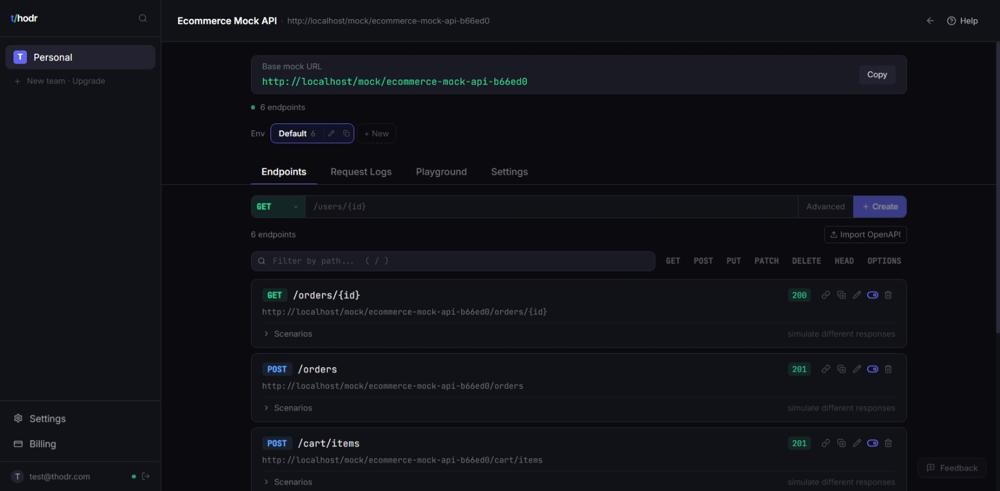
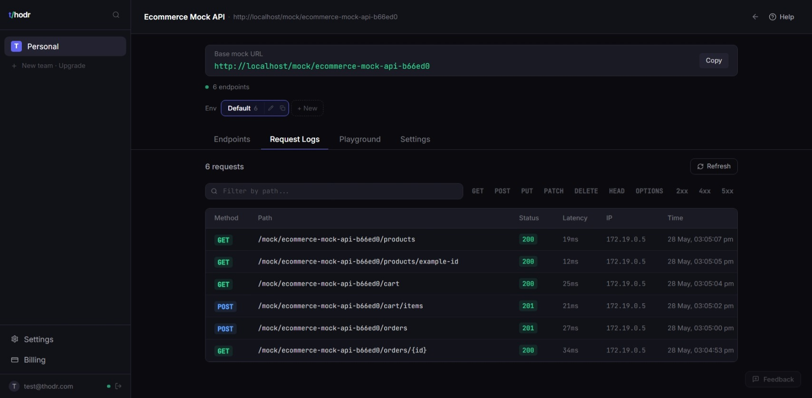
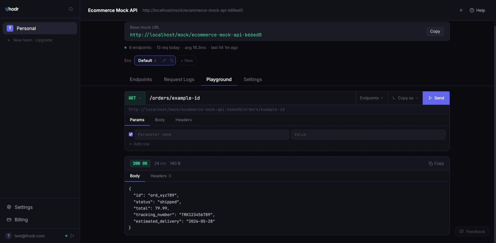
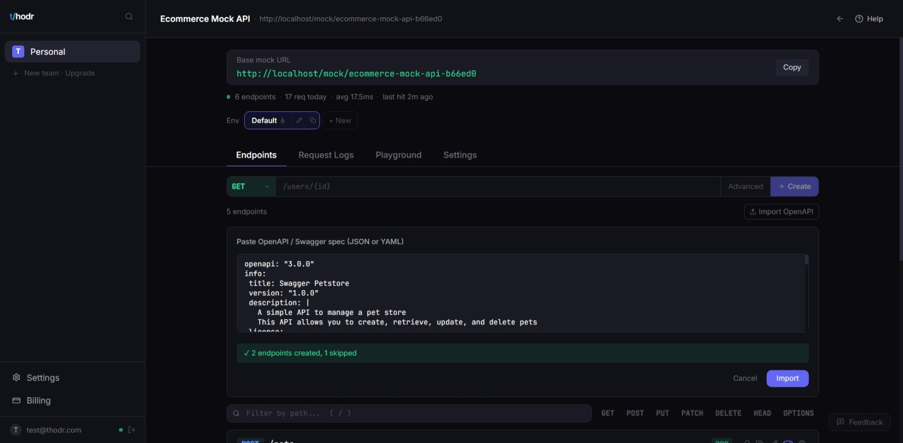

# t/hodr — Examples & Templates

**Hosted mock API infrastructure for developers.**

No Docker. No CLI. No local mock server setup.  
Create a project → add endpoints → get a live URL. Done.

🔗 [thodr.com](https://thodr.com) · 📖 [Docs](https://thodr.com/docs/getting-started) · 🎮 [Demo](https://thodr.com/demo) · 🐦 [@thodrapp](https://x.com/thodrapp)

---

## What is Thodr?

Thodr is a hosted platform for creating, managing, and sharing mock APIs.

You get a permanent URL like:

```
https://thodr.com/mock/your-project/users/42
```

That works immediately — share it with your team, plug it into CI, or use it in staging. No infrastructure to manage.

### Core capabilities

- **Instant hosted endpoints** — live URL in under 30 seconds
- **OpenAPI import** — paste a spec, auto-generate all endpoints
- **Scenario switching** — toggle between success, error, timeout responses
- **Request logs** — every request captured with headers, body, latency
- **Environment isolation** — dev, staging, QA under one project
- **Team workspaces** — invite members, share projects, collaborate
- **API key protection** — restrict access to mock endpoints
- **Webhook forwarding** — forward requests to real upstream URLs
- **Response templating** — dynamic responses with path/query variables
- **Delay simulation** — artificial latency for timeout testing

---

## Why Thodr exists

Frontend and integration work is constantly blocked by:

- Backend APIs that aren't ready yet
- Third-party APIs that are unstable or rate-limited
- Staging environments that break unpredictably
- Local mock servers that drift out of sync

Thodr removes these blockers. One hosted URL, always available, always stable.

---

## Quickstart

```
1. Sign up at thodr.com
2. Create a project → you get a base URL instantly
3. Add an endpoint (or import an OpenAPI spec)
4. Copy the mock URL → start testing immediately
```

No installation. No config files. No Docker. No CLI.

---

## What's in this repository

This repo contains **examples, templates, and OpenAPI specs** you can import directly into Thodr.

```
thodr-examples/
├── openapi/              # OpenAPI specs ready to import
│   ├── ecommerce-api.yaml
│   ├── auth-api.yaml
│   ├── payments-api.yaml
│   └── stripe-webhook-mock.yaml
├── examples/             # Endpoint configuration examples
│   ├── ecommerce-api/
│   ├── auth-api/
│   ├── payments-api/
│   └── webhook-api/
├── postman/              # Postman collections for testing
│   ├── ecommerce.collection.json
│   └── auth.collection.json
├── curl-examples/        # Copy-paste curl commands
│   ├── auth.md
│   ├── payments.md
│   └── scenarios.md
└── screenshots/          # Real product screenshots
    ├── dashboard.jpeg
    ├── logs.jpeg
    ├── playground.jpeg
    └── openapi-import.jpeg
```

---

## OpenAPI specs

Import any of these specs into Thodr to instantly generate a full mock API:

| Spec                                                         | Endpoints | Use case                         |
| ------------------------------------------------------------ | --------- | -------------------------------- |
| [ecommerce-api.yaml](openapi/ecommerce-api.yaml)             | 12        | Products, orders, cart, users    |
| [auth-api.yaml](openapi/auth-api.yaml)                       | 8         | Register, login, refresh, verify |
| [payments-api.yaml](openapi/payments-api.yaml)               | 9         | Charges, refunds, customers      |
| [stripe-webhook-mock.yaml](openapi/stripe-webhook-mock.yaml) | 5         | Webhook event simulation         |

### How to import

1. Go to your Thodr project → click **Import**
2. Paste the raw YAML content (or upload the file)
3. Thodr generates all endpoints with realistic response bodies
4. Your mock API is live immediately

---

## curl examples

Test any Thodr mock endpoint directly:

```bash
# Get a user
curl https://thodr.com/mock/your-project/users/42

# Create an order
curl -X POST https://thodr.com/mock/your-project/orders \
  -H "Content-Type: application/json" \
  -d '{"product_id": "prod_123", "quantity": 2}'

# Simulate an error (with scenario switching)
curl https://thodr.com/mock/your-project/users/999
# → 404 Not Found (if scenario is configured)
```

See [curl-examples/](curl-examples/) for more.

---

## Screenshots

| Dashboard                               | Request Logs                  |
| --------------------------------------- | ----------------------------- |
|  |  |

| Playground                                | OpenAPI Import                            |
| ----------------------------------------- | ----------------------------------------- |
|  |  |

---

## Key differentiators

|                | Thodr           | Local mock servers    | Postman mocks           |
| -------------- | --------------- | --------------------- | ----------------------- |
| Setup time     | 30 seconds      | 10–30 minutes         | 5 minutes               |
| Infrastructure | None (hosted)   | Docker/Node required  | Postman account         |
| Stable URLs    | ✅ Permanent    | ❌ Changes on restart | ✅ But rate-limited     |
| Team sharing   | ✅ Built-in     | ❌ Manual             | ✅ But workspace-locked |
| Request logs   | ✅ Built-in     | ❌ DIY                | ⚠️ Limited              |
| Scenarios      | ✅ Per-endpoint | ❌ Code changes       | ⚠️ Limited              |
| OpenAPI import | ✅ One-click    | ⚠️ Varies             | ✅                      |
| Environments   | ✅ Built-in     | ❌ Manual             | ❌                      |

---

## Links

- **Website** — [thodr.com](https://thodr.com)
- **Interactive demo** — [thodr.com/demo](https://thodr.com/demo)
- **Documentation** — [thodr.com/docs](https://thodr.com/docs/getting-started)
- **Pricing** — [thodr.com](https://thodr.com/#pricing)
- **Changelog** — [thodr.com/changelog](https://thodr.com/changelog)
- **Status** — [thodr.com/status](https://thodr.com/status)
- **Developer tools** — [thodr.com/tools](https://thodr.com/tools)

---

## License

[MIT](LICENSE) — use these examples however you want.

---

<p align="center">
  <strong>No Docker. No CLI. No config files.</strong><br>
  <sub>Hosted mock API infrastructure for modern development teams.</sub><br><br>
  <a href="https://thodr.com">Get started free →</a>
</p>
